# CUDA Flocking

**University of Pennsylvania, CIS 5650: GPU Programming and Architecture, Project 1 - Flocking**

- Faris Rafie Syahzani
- Tested on: Windows 11, AMD Ryzen 7 8845HS, NVIDIA GeForce RTX 4050
  Laptop GPU (6 GB), 16 GB RAM


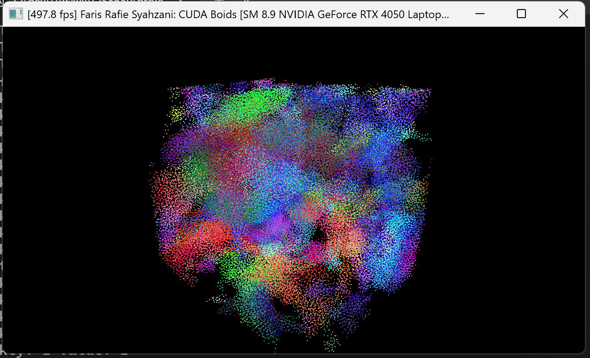

This project implements Reynolds-style flocking on the GPU. Each boid combines
cohesion, separation, and alignment before integrating its position with a fixed
time step.

## Implementations

- **Naive:** every boid tests every other boid, producing quadratic neighbor
  work.
- **Scattered uniform grid:** boids are sorted by cell, while positions and
  velocities remain in their original arrays. Neighbor access uses the sorted
  particle-index array.
- **Coherent uniform grid:** positions and velocities are reordered into cell
  order, making the boids in each cell contiguous in memory.
- **Adaptive grid traversal:** each boid computes the minimum and maximum cell
  coordinates touched by the largest rule radius. This avoids a hard-coded
  neighborhood and is included as the grid-looping extra credit.
- **Shared-memory coherent grid:** one CUDA block owns a grid cell and loads
  neighboring positions and velocities into shared-memory tiles. Boids in the
  owned cell reuse those tiles instead of repeatedly reading them from global
  memory.

## Test setup and methodology

I ran every benchmark in **Release** mode on the laptop listed above, with the
laptop plugged in and V-sync disabled. Before recording a result, I let the
simulation warm up. I also kept the random seed, time step, and number of
measured simulation steps the same so each implementation saw a similar flock.

The main results are averages of five runs. Smaller exploratory and extra-credit
tests use three to five runs, and the error bars show how much the runs varied.
This is more repeatable than manually copying a single FPS value from the window
title.

I used two measurements:

- **FPS** measures the experience of running the whole application, including
  visualization when it is enabled.
- **CUDA event time** measures only a complete GPU simulation step, which makes
  it easier to compare the CUDA implementations without rendering getting in
  the way.

## Results overview

This table reports the mean of five Release-mode trials for visualization-off
application FPS and GPU time per complete simulation step.

| Boids | Naive FPS / GPU ms | Scattered FPS / GPU ms | Coherent FPS / GPU ms |
|---:|---:|---:|---:|
| 1,000 | 1,845 / 0.243 | 1,466 / 0.185 | 1,414 / 0.209 |
| 2,500 | 1,095 / 0.598 | 1,415 / 0.212 | 1,390 / 0.253 |
| 5,000 | 624 / 1.217 | 1,231 / 0.308 | 1,215 / 0.364 |
| 10,000 | 278 / 3.162 | 1,253 / 0.343 | 1,184 / 0.317 |
| 20,000 | 84 / 11.387 | 1,305 / 0.374 | 1,205 / 0.335 |
| 50,000 | — | 911 / 0.619 | 1,273 / 0.404 |
| 100,000 | — | 501 / 1.519 | 1,097 / 0.501 |

Application FPS contains fixed window and interop costs, so its ordering can
differ from GPU-only time when simulation kernels are short.

### How boid count affects each implementation

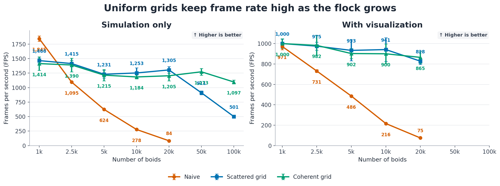

The left panel reports simulation-only FPS with visualization disabled; the
right panel reports FPS with visualization enabled. Both panels compare naive,
scattered-grid, and coherent-grid implementations as the boid count increases.

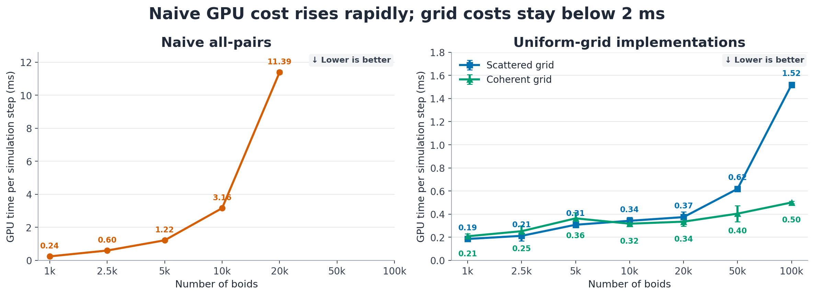

The all-pairs implementation has quadratic neighbor work. From 1,000 to 20,000
boids its measured GPU step grew **46.8×**, from 0.243 to 11.387 ms. Scattered
and coherent grid time grew only 2.02× and 1.60× across the same range. Fixed
setup costs hide the full asymptotic slope at small populations, but the curves
separate rapidly as the workload grows.

At 1,000 boids, naive still has the highest application FPS because it avoids
grid construction. The grid methods overtake it by 2,500 boids. At 20,000,
scattered and coherent are **30.4× and 34.0× faster** than naive in GPU-step
time. The grid sweep continues to 100,000 boids, where coherent runs at 1,097
FPS and 0.501 ms per GPU step. The prohibitively quadratic naive sweep stops at
20,000.

### Visualization cost

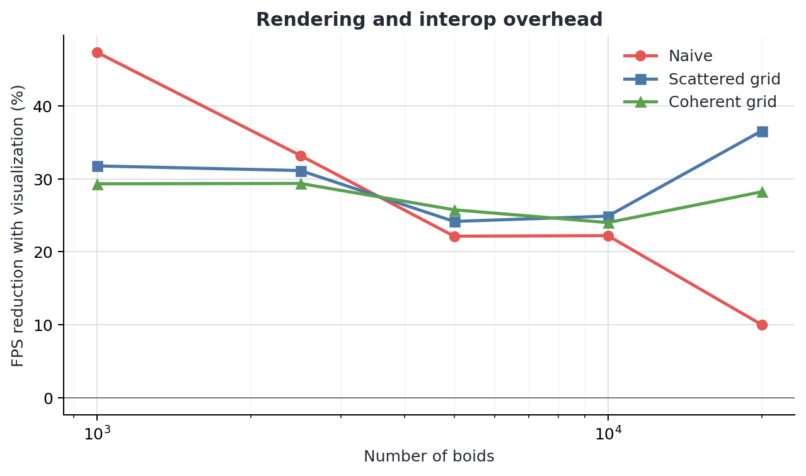

Rendering lowers throughput because each frame performs CUDA/OpenGL interop,
copies boid data to the VBOs, rasterizes points, and presents the back buffer.
Across the tested population sizes, visualization reduces FPS by 10–47% for
naive, 24–37% for scattered, and 24–29% for coherent. The naive percentage falls
at high `N` because simulation already dominates its frame time. At 20,000
boids, visualization-on performance is 75 FPS naive, 828 FPS scattered, and 865
FPS coherent.

### How block size and block count affect each implementation

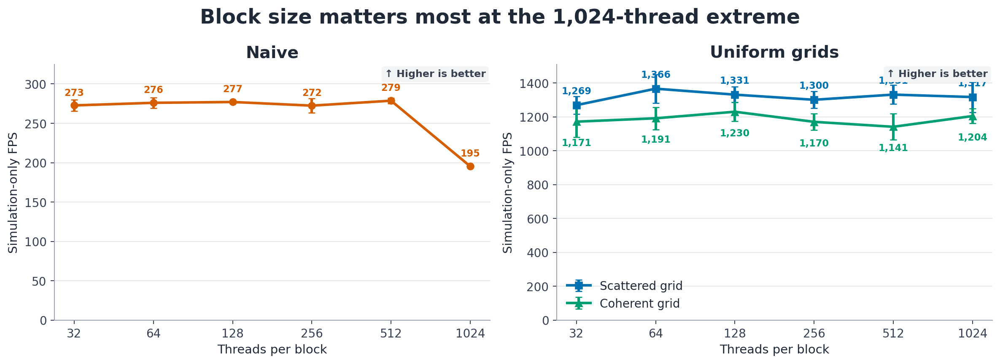

For boid-parallel kernels, block count is `ceil(N / blockSize)`. More boids add
blocks and expose parallelism until the GPU is occupied; beyond that point they
mainly add work. Increasing block size reduces block count, but large blocks can
reduce the number of concurrently resident blocks. Grid-reset kernels launch
from the cell count, and Thrust chooses its own sort schedule, so one block size
cannot optimize every stage equally.

At 10,000 boids, the lowest measured GPU times occurred at 128 threads for naive
(3.162 ms), 256 for scattered (0.298 ms), and 64 for coherent (0.325 ms). Most
32–512-thread grid results overlap within run-to-run variation. At 1,024
threads, naive slowed by 46% and scattered by 24% relative to their minima,
while coherent changed by less than 1%. A block size of 128 is a reasonable
cross-implementation default on this GPU.

### Did coherent storage improve performance?

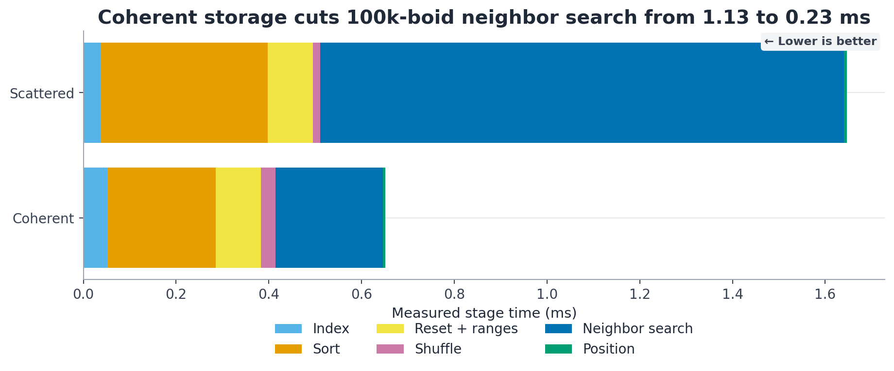

*GPU-stage breakdown for 100,000 boids. Each colored section shows the time
spent indexing, sorting, resetting cell ranges, shuffling data, searching for
neighbors, or updating positions. A shorter total bar is better.*

Yes, coherent storage improved performance once the population was large enough,
which was the expected outcome. It pays an additional shuffle, so it is not
automatically faster at small populations.
Scattered GPU time is 11–19% lower from 1,000 through 5,000 boids. Coherent then
becomes 7% faster at 10,000, 11% at 20,000, 35% at 50,000, and **67% at
100,000** (0.501 versus 1.519 ms).

The 100,000-boid stage profile explains the crossover. Neighbor search falls
from 1.130 ms scattered to 0.231 ms coherent, a 4.89× improvement, while the
coherent shuffle costs 0.031 ms. Reordering is linear work, but contiguous
neighbor reads become increasingly valuable as cells supply more particle data.
Stage timings are used for attribution; their extra event synchronization means
their sum is not expected to match the batched whole-step measurement exactly.

### Did cell width and checking 27 versus 8 cells affect performance?

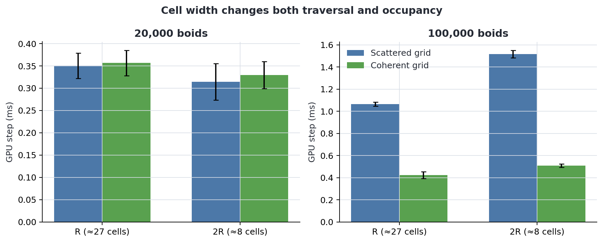

Yes, cell width affected performance, but the faster choice changed with boid
density. Cell width `R = 5` generally intersects about 27 cells, while width `2R = 10`
generally intersects about eight. The exact range varies near cell and domain
boundaries.

At 20,000 boids, width `R` reduces candidate tests by 38–41%, but it also visits
27 cells and maintains a larger grid. Consequently, `2R` is 10% faster for
scattered and 8% faster for coherent. At 100,000 boids the balance reverses:
`R` cuts candidate work by about 53% and is **1.42× faster** for scattered and
**1.20× faster** for coherent. Maximum occupancy falls from roughly 44–45 boids
per `2R` cell to 8–9 per `R` cell.

The performance difference therefore depends on candidate boids, occupancy,
memory locality, and grid maintenance, not only the number of cells visited.
Eight coarse cells can contain more candidates than 27 narrow cells.

### Adaptive grid-looping

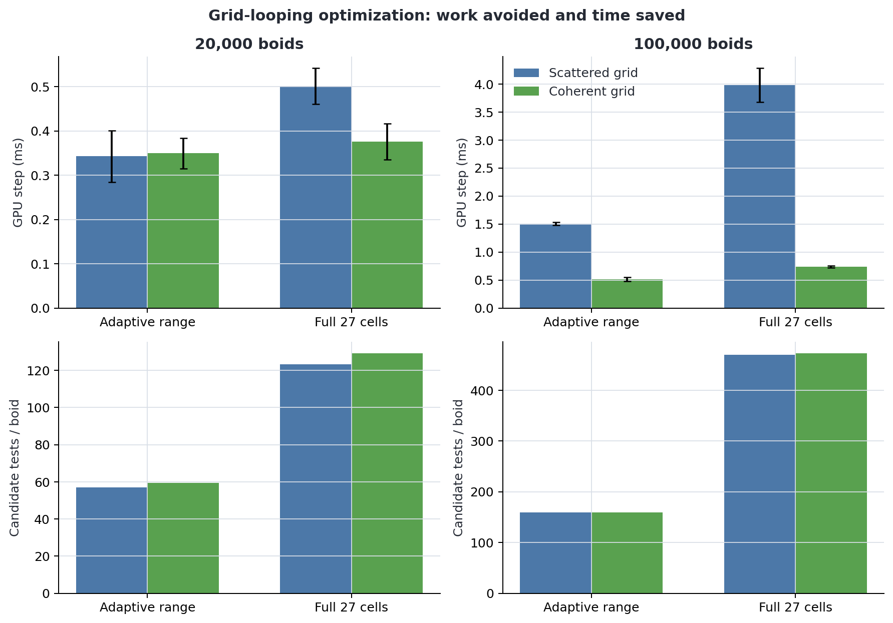

With `2R` cells, the adaptive bounds visit 8 cells for these interior positions
instead of nearly 27. They reduce candidate tests by 54% at 20,000 boids and 66%
at 100,000. Relative to a full 27-cell traversal, GPU-step speedups are **1.46×
scattered / 1.08× coherent** at 20,000 and **2.65× / 1.43×** at 100,000. The
larger scattered benefit follows from its more expensive indirect candidate
reads. Both paths clamp their ranges at domain boundaries.

### Shared-memory optimization

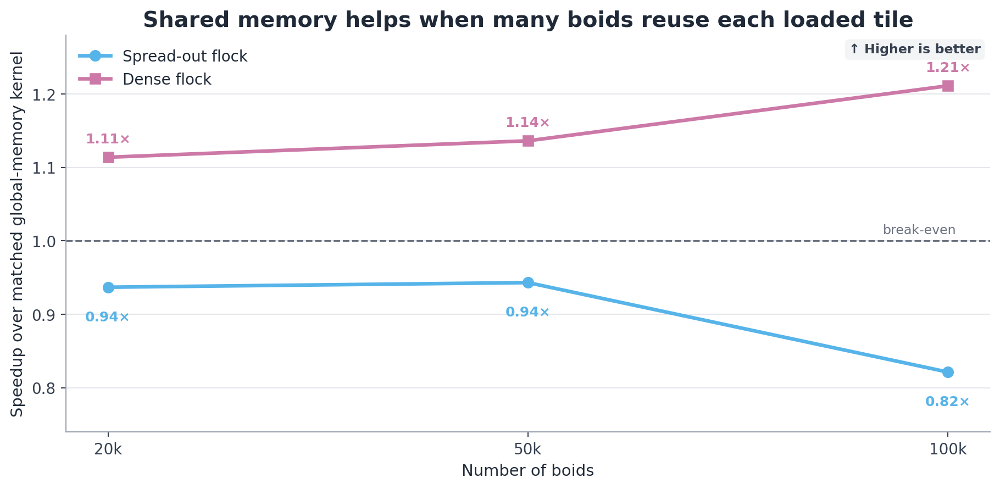

The shared-memory kernel assigns one block to each occupied source cell. Threads
cooperatively load a neighboring cell's positions and velocities into shared
memory, synchronize, and reuse that tile for every active boid in the source
cell. Cells larger than one block are processed in batches. This reduces
repeated global-memory reads without changing the flocking rules.

I compared it against a matched cell-owned control kernel with the same 27-cell
traversal, arithmetic, block size, and input state; the only experimental change
was whether candidate data came directly from global memory or from a shared
tile. Each point is the mean of five fixed-state CUDA-event replays.

Shared memory is beneficial when there is enough reuse. For a dense flock, it is
**1.11× faster at 20,000 boids, 1.14× at 50,000, and 1.21× at 100,000**. For the
spread-out input it reaches only 0.94×, 0.94×, and 0.82× of the control's speed.
Sparse cells leave many block lanes inactive, so tile loads and two barriers per
tile cost more than the few global reads they replace. Dense cells amortize that
overhead across many boids. Shared memory is therefore an optimization for high
cell occupancy rather than an unconditional improvement.

### Simulation age and seed sensitivity

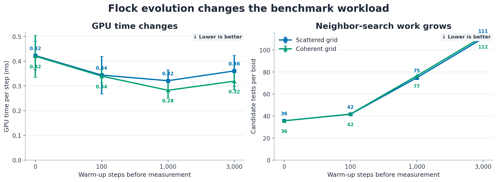

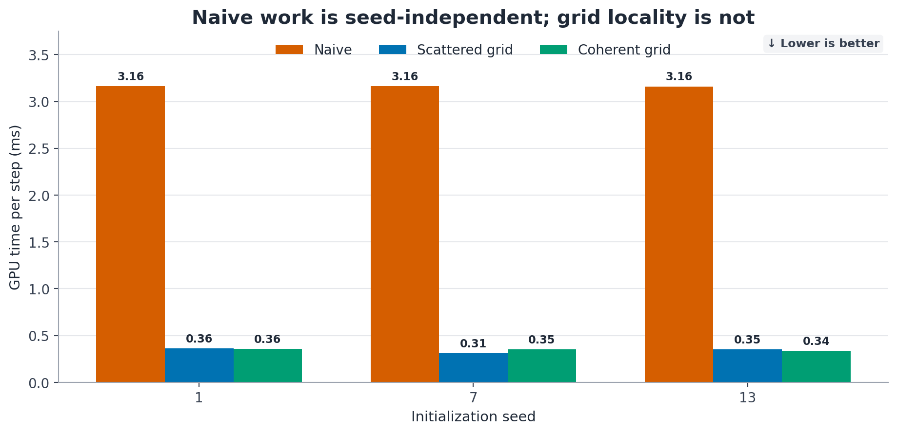

The flock is a changing workload. From age 0 to 3,000 warm-up steps, occupied
cells fall from about 4,240 to 1,840 and candidate tests rise from 35.7 to 111
per boid as the flock clusters. GPU time first falls as occupancy and launch
efficiency improve, reaches its minimum near age 1,000, and then rises as
candidate work dominates. Every primary comparison therefore uses the same seed,
warm-up age, and measured step count.

Changing the seed barely affects naive GPU time: the range of seed means is
0.02% because it always checks all pairs. The corresponding range is 15.1% for
scattered and 6.5% for coherent, whose work and locality depend on spatial
distribution. Repetition and error bars are necessary; a single title-bar FPS
sample is not a repeatable benchmark.

## Correctness

During analysis, I compared the scattered, coherent, adaptive, and shared-memory
grid results against the brute-force implementation across sparse and dense
inputs, cell widths `R` and `2R`, non-warp-aligned populations, domain edges,
and exact rule boundaries. The maximum absolute component error was `1.8e-6`.
Repeated fixed configurations were deterministic, and NVIDIA Compute Sanitizer
reported zero memory errors.

## Build and run

```powershell
cmake -S . -B build
cmake --build build --config Release
.\build\bin\Release\cis5650_boids.exe
```

The checked-in configuration launches the shared-memory coherent-grid
implementation with visualization enabled and 100,000 boids. Set
`SHARED_MEMORY_GRID` to `0` to use the standard coherent-grid kernel. Change
`VISUALIZE`, `UNIFORM_GRID`, `COHERENT_GRID`, `N_FOR_VIS`, and `blockSize` for
other configurations.

Mouse drag rotates the camera, right-drag zooms, and Escape closes the window.

## CMake modifications

`CMakeLists.txt` is unchanged from the project version used before the
performance analysis. No benchmark-only build definitions or dependencies are
included.

Timing methodology follows NVIDIA's [CUDA C++ Best Practices Guide](https://docs.nvidia.com/cuda/cuda-c-best-practices-guide/index.html#timing),
and frame presentation follows GLFW's [swap-interval behavior](https://www.glfw.org/docs/latest/window.html#buffer_swap).

## Blooper: boids going away

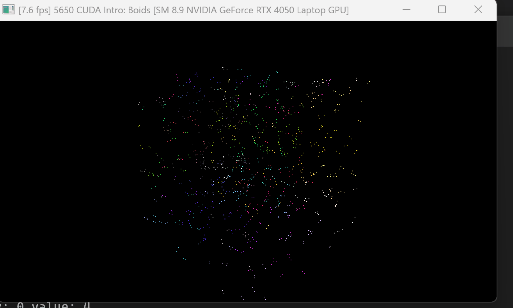

An early version of the cohesion rule used the perceived center as a velocity
change directly:

```cpp
return percieved_center * rule1Scale;
```

The rule needs the direction from the current boid to that center:

```cpp
return (percieved_center - pos[iSelf]) * rule1Scale;
```

Without subtracting the boid's own position, the code treats an absolute world
position as a direction. The resulting incorrect steering made the flock fly
away, producing the animation above.
